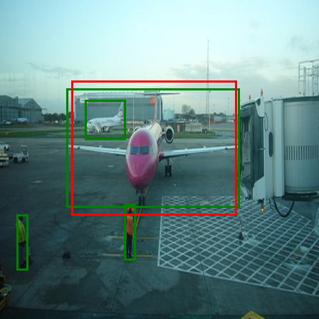
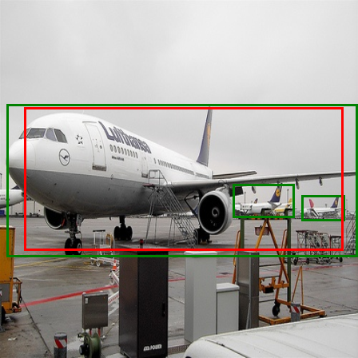
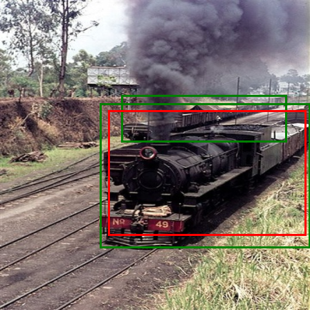
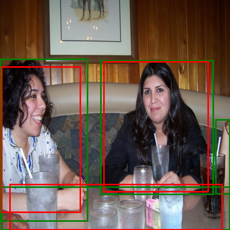

# YOLO v1 from Scratch (PyTorch)

A from-scratch implementation of YOLO v1 including custom model architecture,
loss function, VOC dataset encoding, training loop, and visualization.

## What was implemented from scratch

- YOLO v1 convolutional architecture (Darknet-style CNN)
- Custom YOLO v1 loss function (coordinate, confidence, class losses)
- VOC label encoding into 7×7×30 grid format
- IOU computation and responsible box selection
- Training loop and overfitting sanity checks
- Prediction decoding and visualization

Not used:
- No pretrained weights
- No torchvision detection models
- No built-in YOLO loss or dataset utilities

## Model Architecture

Input: 448×448 RGB image  
Output: 7×7×30 tensor

Per grid cell:
- 2 bounding boxes: (x, y, w, h, confidence)
- 20 class probabilities (VOC)

Total output per cell = 2×5 + 20 = 30

## Loss Function (YOLO v1)

The loss consists of three parts:

1. Localization loss  
   - Penalizes errors in bounding box center (x, y)
   - Penalizes errors in width and height (square root as in paper)

2. Confidence loss  
   - For cells containing objects: confidence ≈ IOU
   - For cells without objects: penalized with lower weight (λ_noobj)

3. Classification loss  
   - Mean squared error over class probabilities

Only the bounding box with highest IOU in a cell is responsible for prediction.

## Dataset

- Dataset: PASCAL VOC 2007
- Each image encoded into a 7×7×25 tensor:
  - [x, y, w, h, objectness, 20 class one-hot]

Encoding details:
- (x, y) are relative to the grid cell
- (w, h) are relative to image size
- Only one object per grid cell (YOLO v1 limitation)

## Training

- Optimizer: SGD
- Loss: custom YOLO v1 loss
- Sanity check: overfitting on 4 images
- Verified learning by visualizing predicted vs ground-truth boxes

Full VOC training was not completed due to compute constraints.

## Results (Overfitting Check)

Below are visualizations comparing:
- Green: Ground truth
- Red: Model predictions







## Limitations

- YOLO v1 predicts only one object per grid cell
- Struggles with small or overlapping objects
- Uses MSE loss for classification (not ideal)
- No anchor boxes (introduced in later YOLO versions)
- Training is unstable without careful tuning

 ## How to Run

Install dependencies:
```bash
pip install -r requirements.txt
python train/yolo_train.py
python visualization/overfit_visual.py
